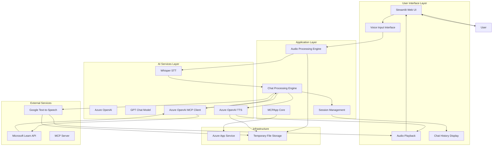
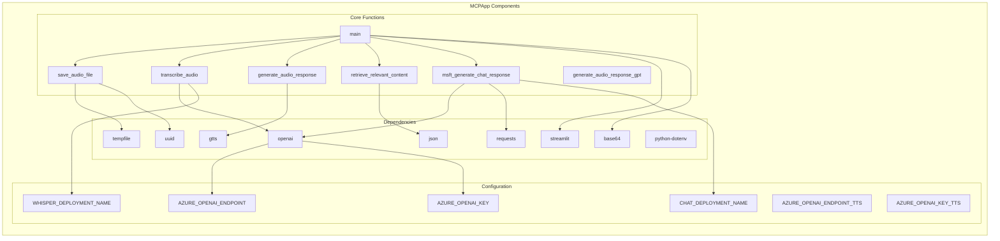
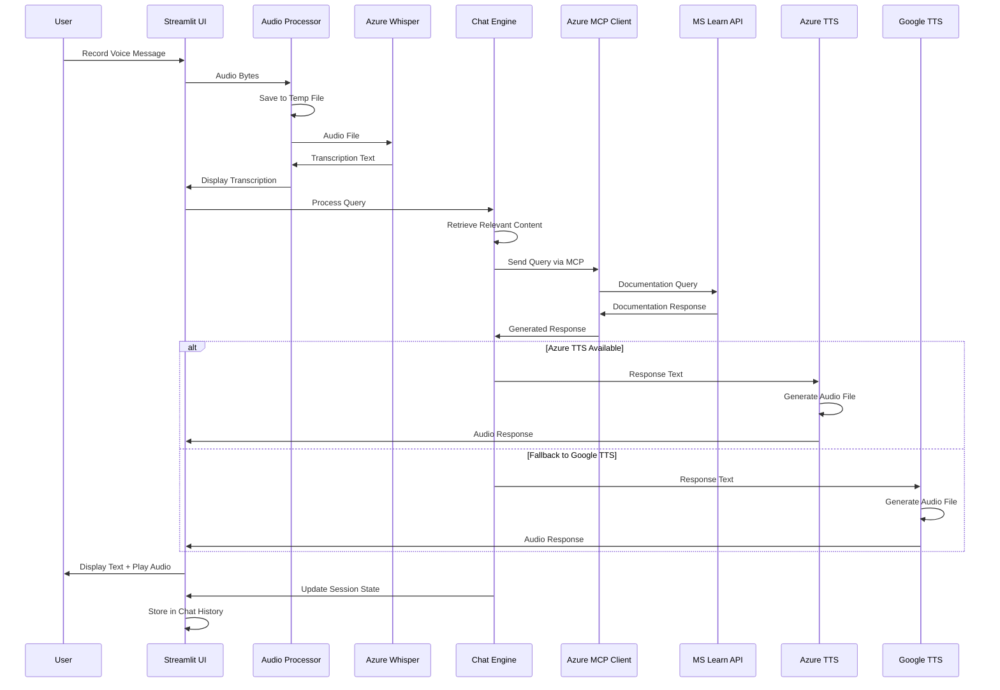
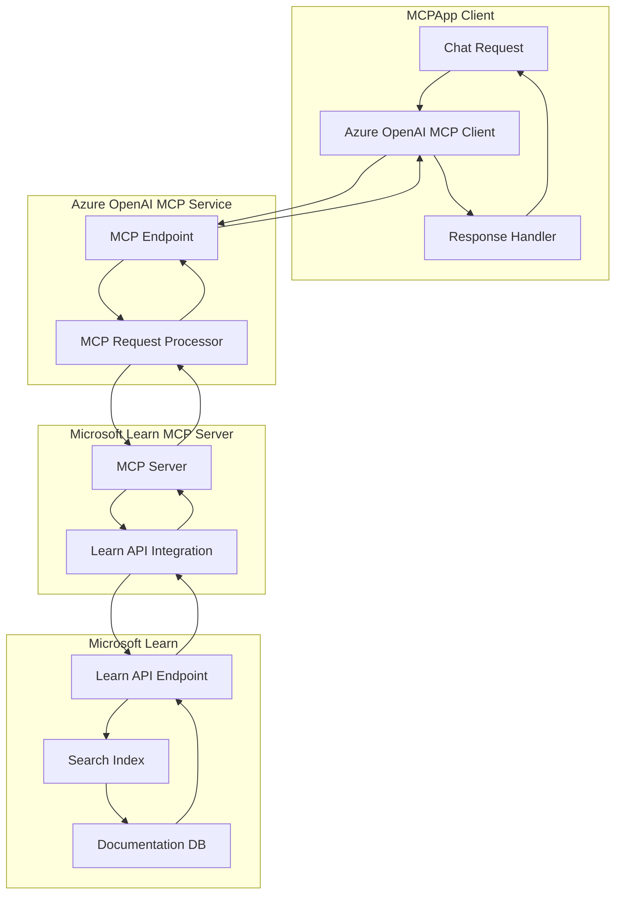
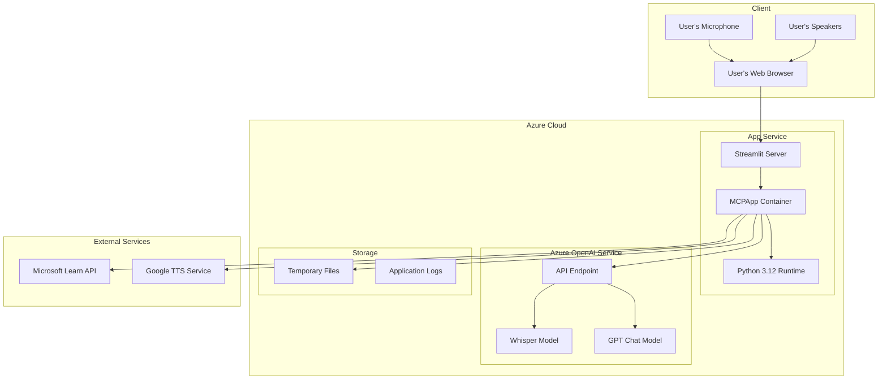
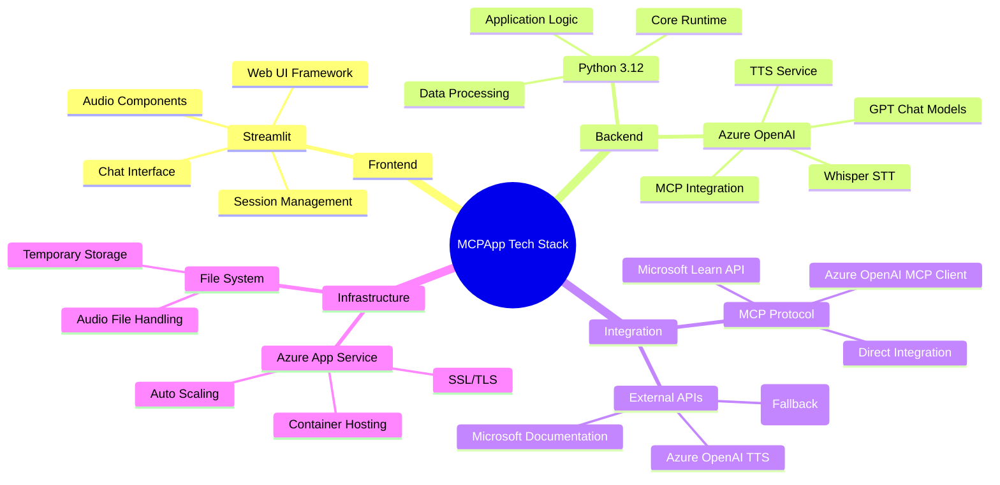
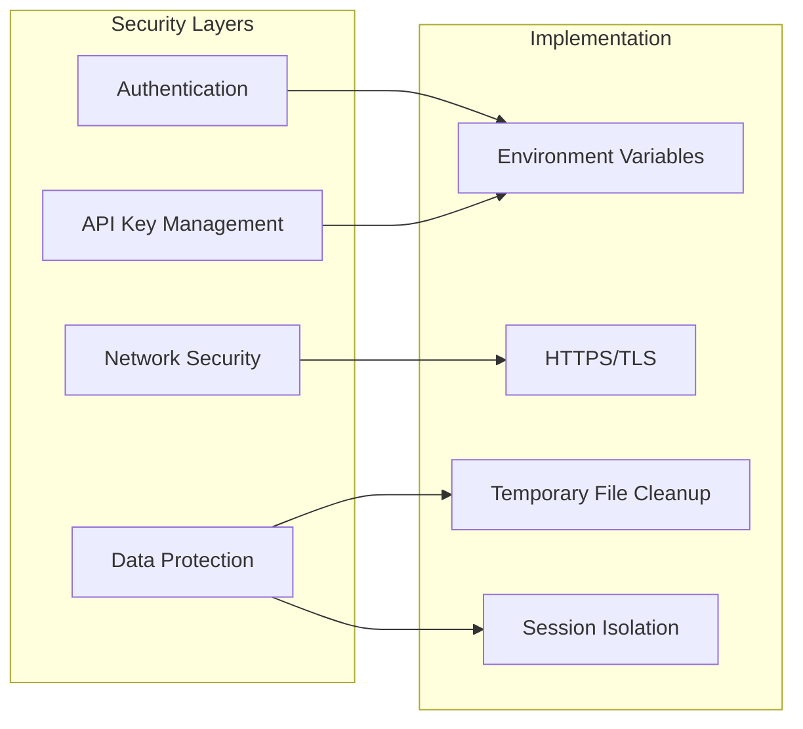

# MCPApp Architecture Blueprint

## Executive Summary

MCPApp is a voice-enabled conversational AI application that provides intelligent responses to user queries by leveraging Azure OpenAI services and Microsoft Learn documentation through enhanced Model Context Protocol (MCP) integration. The application features dual text-to-speech capabilities and specialized Microsoft Learn interface, enabling natural language conversations through voice input/output powered by advanced AI models and real-time documentation retrieval.

## High-Level System Architecture

## Component Architecture

## Data Flow Architecture

## MCP Integration Architecture

## Deployment Architecture

## Technology Stack Overview

## System Components Detail

### User Interface Layer
- **Streamlit Web UI**: Primary interface for user interactions
- **Voice Input Interface**: Captures audio input from users
- **Audio Playback**: Renders AI-generated audio responses
- **Chat History Display**: Shows conversation history with timestamps

### Application Layer
- **Audio Processing Engine**: Handles audio file operations and transcription
- **Chat Processing Engine**: Manages conversation flow and context
- **Session Management**: Maintains user session state and history

### AI Services Layer
- **Azure OpenAI Whisper**: Speech-to-text transcription service
- **Azure OpenAI MCP Client**: Direct integration with Microsoft Learn via MCP
- **Azure OpenAI TTS**: Primary text-to-speech service (gpt-4o-mini-tts)

### External Integrations
- **Microsoft Learn API**: Source of technical documentation via MCP
- **Azure OpenAI TTS**: Primary audio response generation
- **Google Text-to-Speech**: Fallback audio response service

## Key Features

### Voice-First Interface
- Natural language voice input processing
- Real-time audio transcription via Azure Whisper
- Dual text-to-speech response generation (Azure OpenAI + Google TTS)
- Hands-free interaction capability with wide layout UI

### Enhanced MCP Integration
- Direct Azure OpenAI MCP client integration
- Real-time Microsoft Learn documentation access
- Streamlined response processing without intermediary function calls
- Optimized for Microsoft Learn queries and content

### Conversational Memory
- Session-based chat history maintenance with audio playback
- Context preservation across conversation turns
- Multi-turn conversation support with embedded audio responses
- Wide layout interface for enhanced user experience

### Azure Cloud Integration
- Scalable Azure App Service deployment
- Comprehensive Azure OpenAI service integration (STT, Chat, TTS)
- Enterprise-grade security and compliance

## Security Considerations

## Performance Considerations

- **Audio Processing**: Efficient temporary file management with automatic cleanup
- **API Optimization**: Direct Azure OpenAI integration for minimal latency
- **Memory Management**: Session-based state management to prevent memory leaks
- **Scalability**: Stateless design for horizontal scaling on Azure App Service

## Future Enhancement Opportunities

1. **Multi-language Support**: Extend voice input/output to multiple languages
2. **Advanced RAG**: Implement vector embeddings for improved context retrieval
3. **User Authentication**: Add user accounts and personalized experiences
4. **Analytics Dashboard**: Real-time usage and performance monitoring
5. **Mobile App**: Native mobile application development
6. **Offline Capabilities**: Local model deployment for offline operation

## Troubleshooting Guide

### Common Issues
- **Missing Environment Variables**: Ensure all Azure OpenAI credentials are configured
- **Audio Processing Failures**: Verify microphone permissions and file system access
- **MCP Connection Issues**: Check Microsoft Learn API availability and network connectivity
- **Deployment Problems**: Validate Azure App Service configuration and dependencies

### Monitoring Points
- Azure OpenAI API response times
- MCP server connection status
- Audio file processing duration
- Session state memory usage
- External API availability