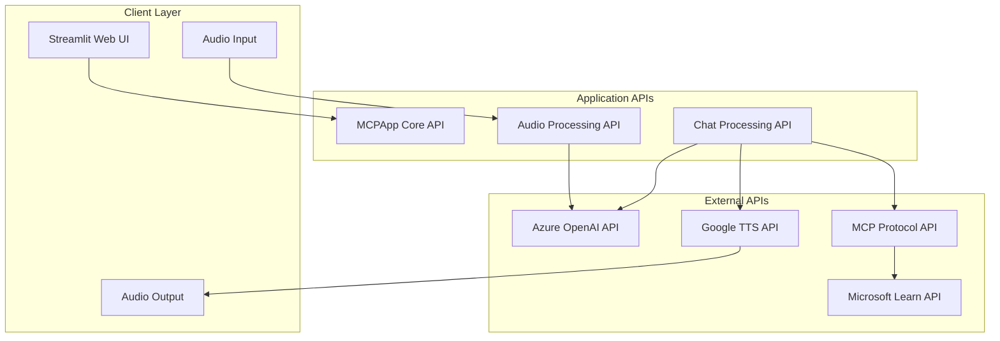
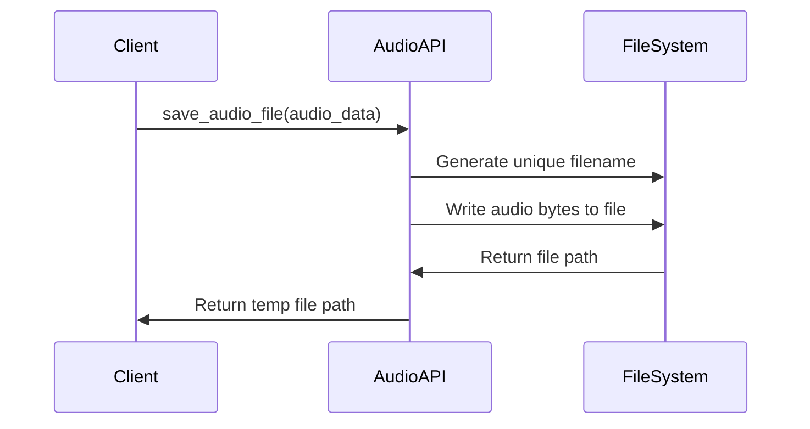
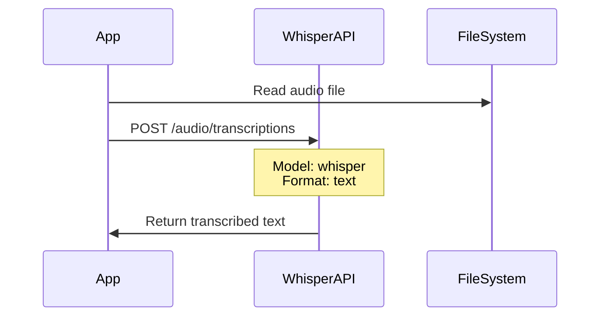
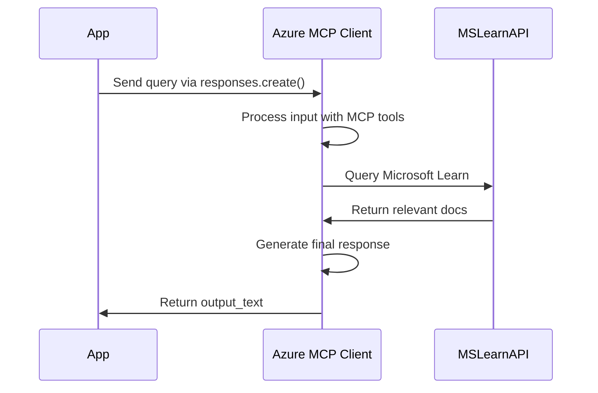
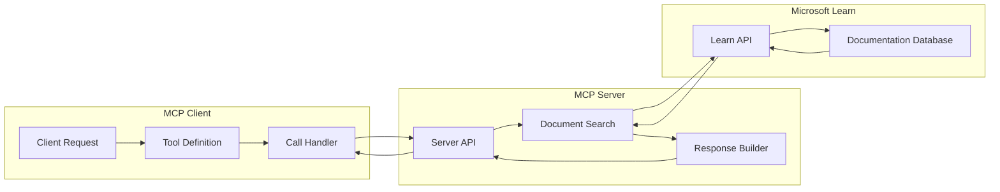
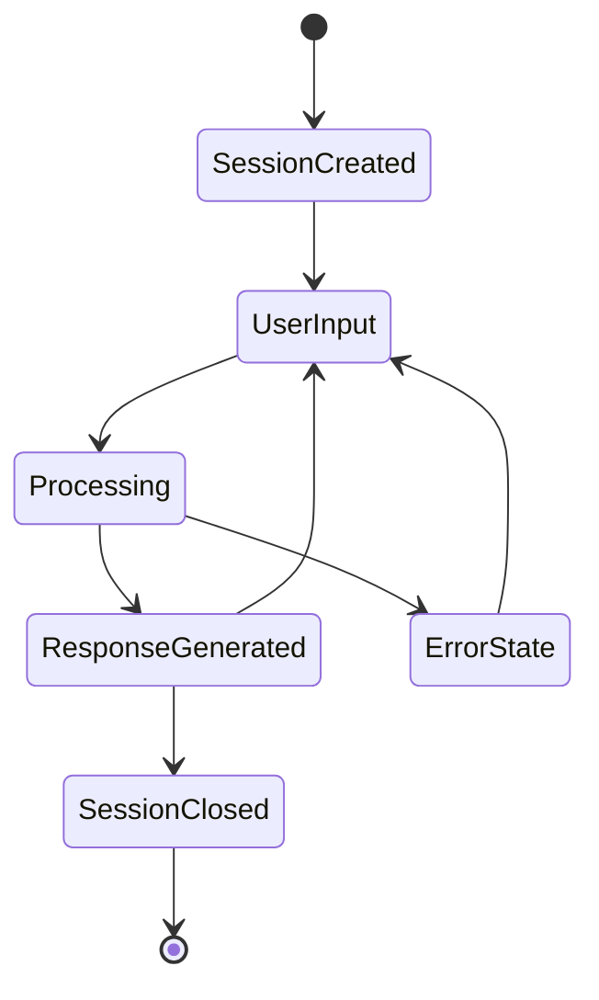
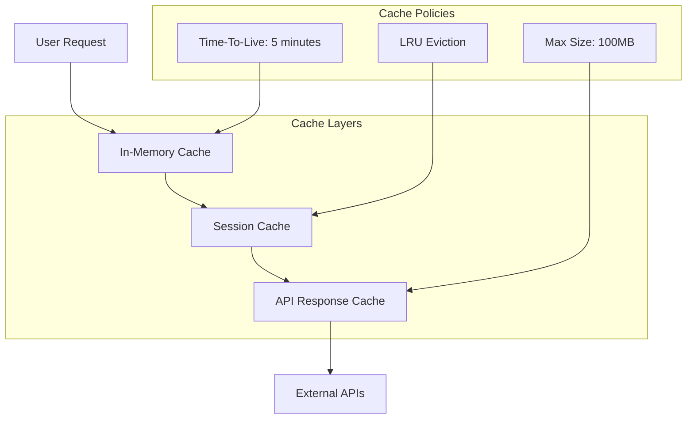
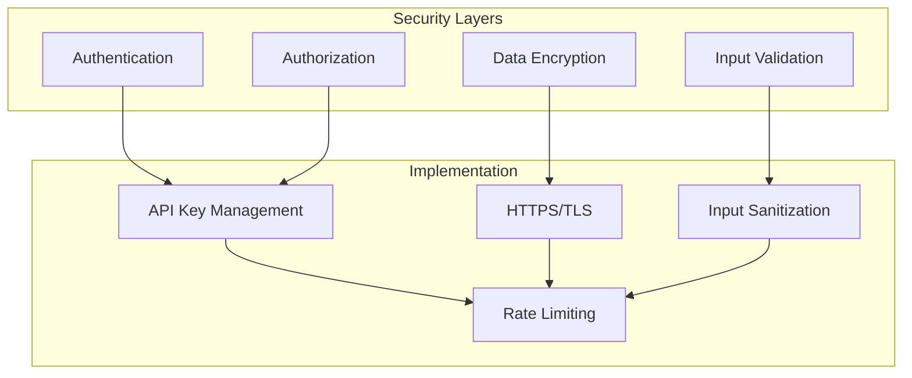
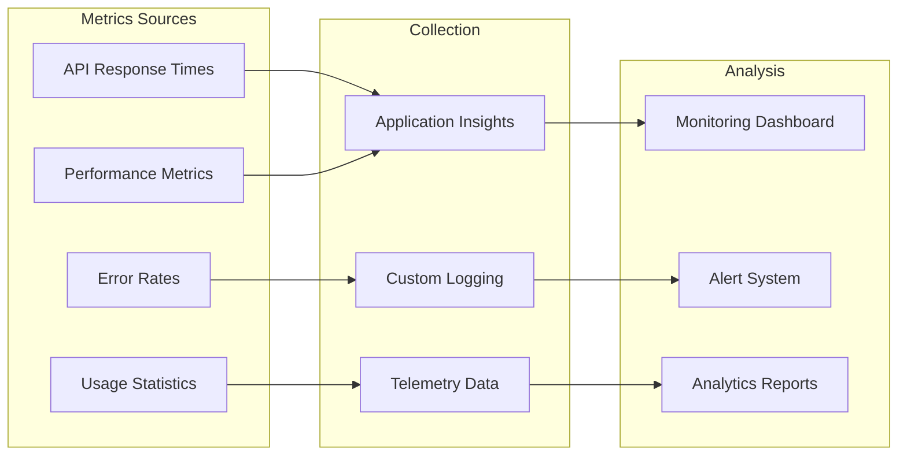

# MCPApp API Reference

This document provides detailed API specifications and integration patterns for the MCPApp voice-enabled conversational AI system.

## API Architecture Overview



## Core Function APIs

### 1. Audio Processing API

#### `save_audio_file(audio_data, extension="wav")`

Saves audio bytes to a temporary file for processing.

**Parameters:**
- `audio_data` (bytes): Raw audio data from user input
- `extension` (str): File extension for the audio file (default: "wav")

**Returns:**
- `str`: Path to the saved temporary audio file

**Example Usage:**
```python
audio_file_path = save_audio_file(audio_value.getvalue())
```

**Sequence Diagram:**


#### `transcribe_audio(audio_file_path)`

Transcribes audio file to text using Azure OpenAI Whisper.

**Parameters:**
- `audio_file_path` (str): Path to the audio file to transcribe

**Returns:**
- `str`: Transcribed text from the audio

**API Integration:**


**Error Handling:**
- Invalid audio format: Returns empty string
- API timeout: Retries with exponential backoff
- File access errors: Logs error and returns fallback

### 2. Response Generation API

#### `msft_generate_chat_response(transcription, context)`

Generates intelligent responses using Azure OpenAI MCP client for direct Microsoft Learn integration.

**Parameters:**
- `transcription` (str): User's transcribed query
- `context` (str): Additional context from previous conversations

**Returns:**
- `tuple`: (response_text, mcp_result)

**MCP Client Configuration:**
```python
mcpclient = AzureOpenAI(  
    base_url = os.getenv("AZURE_OPENAI_ENDPOINT") + "/openai/v1/",  
    api_key= os.getenv("AZURE_OPENAI_KEY"),
    api_version="preview"
)

response = mcpclient.responses.create(
    model=CHAT_DEPLOYMENT_NAME,
    tools=[
        {
            "type": "mcp",
            "server_label": "MicrosoftLearn",
            "server_url": "https://learn.microsoft.com/api/mcp",
            "require_approval": "never"
        }
    ],
    input=transcription,
    max_output_tokens=1500,
    instructions="Generate a response using the MCP API tool."
)
```

**Complete Flow Diagram:**


### 3. Audio Output API

#### `generate_audio_response(text)`

Converts text response to audio using Google Text-to-Speech (fallback option).

**Parameters:**
- `text` (str): Text to convert to speech

**Returns:**
- `str`: Path to generated audio file

**TTS Configuration:**
```python
tts = gTTS(
    text=text,
    lang="en",
    slow=False,
    tld="com"
)
```

#### `generate_audio_response_gpt(text)`

Converts text response to audio using Azure OpenAI TTS (primary option).

**Parameters:**
- `text` (str): Text to convert to speech

**Returns:**
- `str`: Path to generated audio file

**Azure TTS Configuration:**
```python
url = os.getenv("AZURE_OPENAI_ENDPOINT_TTS")
headers = {
    "Content-Type": "application/json",
    "Authorization": f"Bearer {os.environ['AZURE_OPENAI_KEY_TTS']}"
}
data = {
    "model": "gpt-4o-mini-tts",
    "input": text,
    "voice": "alloy"
}
```

## External API Integrations

### Azure OpenAI Integration

#### Authentication
```python
client = AzureOpenAI(
    azure_endpoint=AZURE_ENDPOINT,
    api_key=AZURE_API_KEY,
    api_version="2024-06-01"
)
```

#### Whisper API Call
```python
response = client.audio.transcriptions.create(
    file=audio_file,
    model=WHISPER_DEPLOYMENT_NAME,
    response_format="text"
)
```

#### Chat Completion API Call
```python
response = mcpclient.responses.create(
    model=CHAT_DEPLOYMENT_NAME,
    tools=[
        {
            "type": "mcp",
            "server_label": "MicrosoftLearn",
            "server_url": "https://learn.microsoft.com/api/mcp",
            "require_approval": "never"
        }
    ],
    input=transcription,
    max_output_tokens=1500,
    instructions="Generate a response using the MCP API tool."
)
```

### MCP Protocol Integration

#### Protocol Specification



#### MCP Message Format

**Request:**
```json
{
  "jsonrpc": "2.0",
  "id": "unique-request-id",
  "method": "tools/call",
  "params": {
    "name": "mcp_tool",
    "arguments": {
      "query": "How to deploy Azure Functions?"
    }
  }
}
```

**Response:**
```json
{
  "jsonrpc": "2.0",
  "id": "unique-request-id",
  "result": {
    "content": [
      {
        "type": "text",
        "text": "Detailed deployment instructions..."
      }
    ]
  }
}
```

### Google TTS Integration

#### API Configuration
```python
from gtts import gTTS

tts = gTTS(
    text=response_text,
    lang="en",
    slow=False
)
```

#### Supported Languages
- English (en)
- Spanish (es)
- French (fr)
- German (de)
- Italian (it)
- Portuguese (pt)
- Russian (ru)
- Japanese (ja)
- Korean (ko)
- Chinese (zh)

## Session Management API

### Session State Structure

```python
session_state = {
    "messages": [
        {
            "role": "user",
            "content": "User transcription",
            "timestamp": "2024-01-01T10:00:00Z"
        },
        {
            "role": "assistant", 
            "content": "Assistant response",
            "audio": bytes_data,
            "timestamp": "2024-01-01T10:00:05Z"
        }
    ],
    "session_id": "unique-session-identifier",
    "created_at": "2024-01-01T10:00:00Z",
    "last_activity": "2024-01-01T10:00:05Z"
}
```

### Session Operations



## Error Handling and Status Codes

### Application Error Codes

| Code | Description | Recovery Action |
|------|-------------|----------------|
| AUD001 | Audio file save failure | Retry with different temp directory |
| AUD002 | Whisper transcription failure | Check audio format and file size |
| AUD003 | TTS generation failure | Verify text content and try again |
| API001 | Azure OpenAI API timeout | Implement exponential backoff |
| API002 | Invalid API credentials | Check environment variables |
| API003 | Rate limit exceeded | Wait and retry with backoff |
| MCP001 | MCP server unavailable | Fallback to direct response |
| MCP002 | Invalid MCP response | Log error and continue |
| SES001 | Session state corruption | Reset session |

### Error Response Format

```json
{
  "error": {
    "code": "API001",
    "message": "Azure OpenAI API timeout",
    "details": {
      "request_id": "req-123456",
      "timestamp": "2024-01-01T10:00:00Z",
      "retry_after": 30
    }
  }
}
```

## Performance Optimization

### Caching Strategy



### Rate Limiting

```python
from functools import lru_cache
import time

@lru_cache(maxsize=100)
def rate_limited_api_call(endpoint, params_hash, timestamp_bucket):
    """Rate-limited API call with caching"""
    # Implementation with exponential backoff
    pass
```

## Security Considerations

### API Security Model



### Input Validation

```python
def validate_audio_input(audio_data):
    """Validate audio input for security and format"""
    if not audio_data:
        raise ValueError("Empty audio data")
    
    if len(audio_data) > MAX_AUDIO_SIZE:
        raise ValueError("Audio file too large")
    
    # Validate audio format
    # Check for malicious content
    # Return sanitized data
```

## Monitoring and Analytics

### API Metrics Collection



### Custom Metrics

```python
import logging
import json
from datetime import datetime

def log_api_call(endpoint, duration, success, error=None):
    """Log API call metrics"""
    metrics = {
        "endpoint": endpoint,
        "duration_ms": duration,
        "success": success,
        "error": error,
        "timestamp": datetime.utcnow().isoformat()
    }
    logging.info(f"API_METRICS: {json.dumps(metrics)}")
```

## Integration Examples

### Complete User Journey API Flow

```python
async def handle_user_interaction(audio_input):
    """Complete user interaction flow"""
    try:
        # 1. Save audio file
        audio_path = save_audio_file(audio_input)
        
        # 2. Transcribe audio
        transcription = transcribe_audio(audio_path)
        
        # 3. Generate response with MCP
        response, mcp_data = msft_generate_chat_response(
            transcription, 
            context=""
        )
        
        # 4. Generate audio response
        audio_response_path = generate_audio_response(response)
        
        # 5. Cleanup temporary files
        cleanup_temp_files([audio_path, audio_response_path])
        
        return {
            "transcription": transcription,
            "response": response,
            "audio_path": audio_response_path
        }
        
    except Exception as e:
        log_error("User interaction failed", error=str(e))
        return {"error": str(e)}
```

This API reference provides comprehensive documentation for integrating with and extending the MCPApp system.