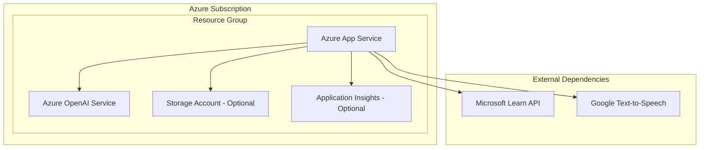
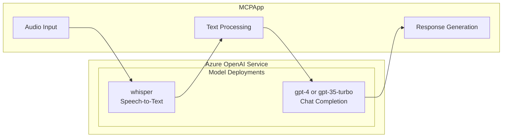
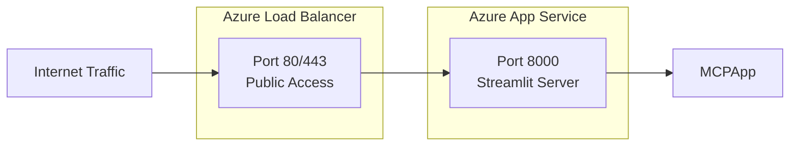
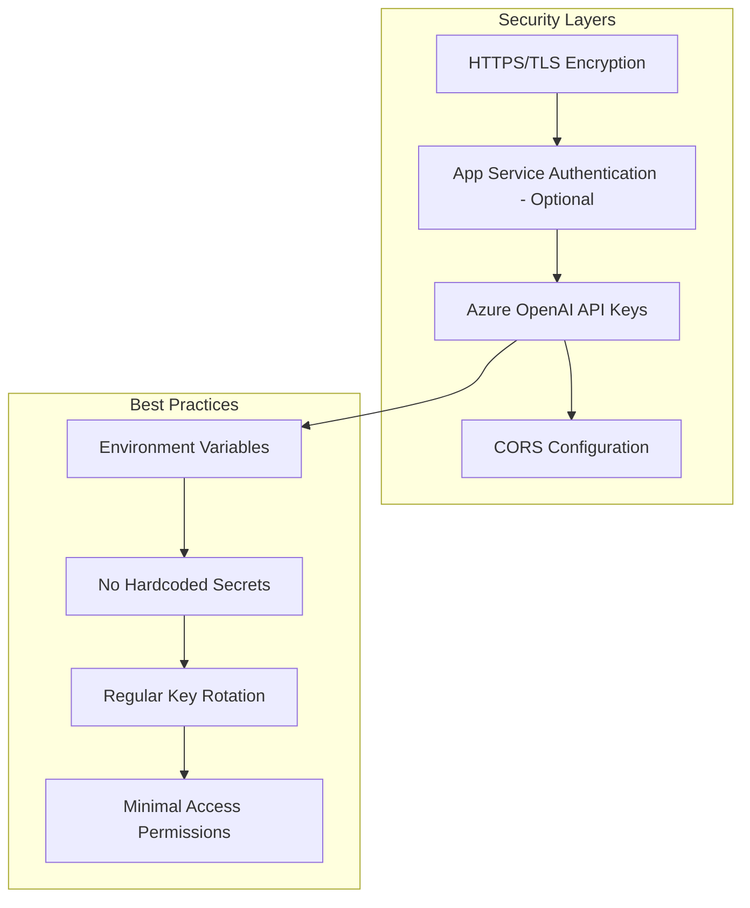
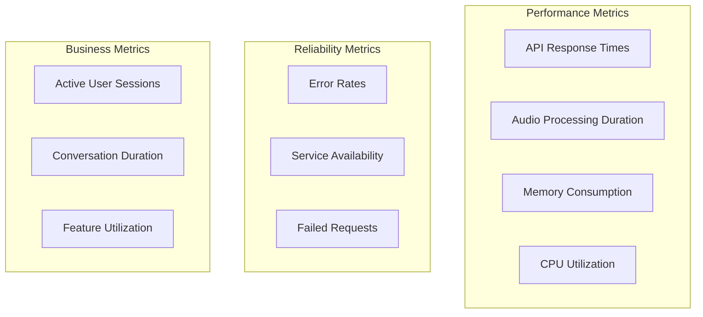
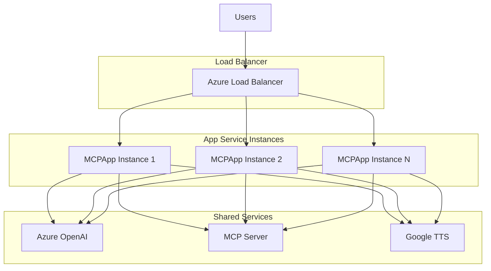
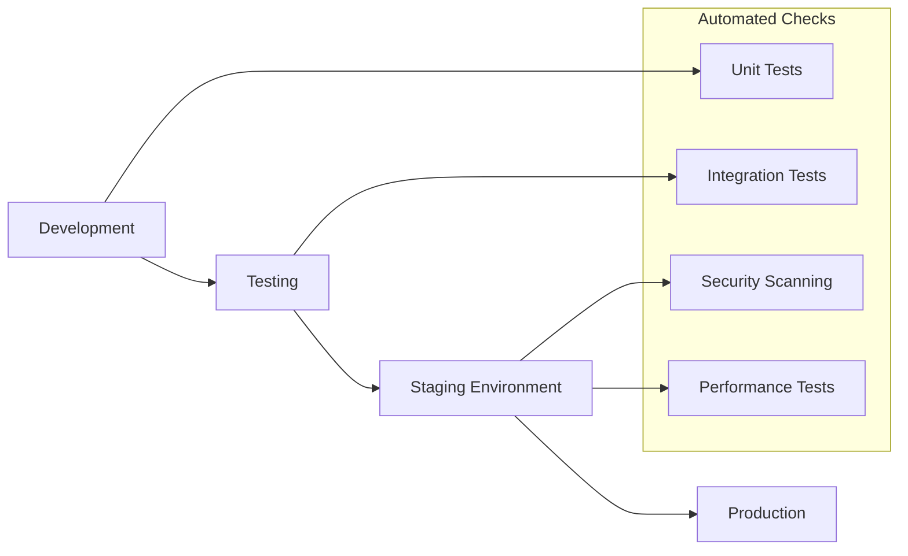

# MCPApp Deployment Guide

This guide provides comprehensive instructions for deploying MCPApp to Azure App Service with proper configuration and monitoring.

## Prerequisites

### Azure Resources Required



### Required Services
1. **Azure App Service** (Linux, Python 3.12)
2. **Azure OpenAI Service** with:
   - Whisper model deployment
   - GPT-4 or GPT-3.5-turbo deployment
3. **Internet access** for external API calls

### Development Tools
- Azure CLI
- Git
- Python 3.12+
- Visual Studio Code (recommended)

## Configuration Setup

### Environment Variables

Create and configure the following environment variables in Azure App Service:

```bash
# Azure OpenAI Configuration
AZURE_OPENAI_ENDPOINT=https://your-openai-resource.openai.azure.com/
AZURE_OPENAI_KEY=your-api-key-here
AZURE_OPENAI_DEPLOYMENT=your-gpt-deployment-name

# Optional: Project Configuration
AZURE_AI_PROJECT=your-project-name
AZURE_SUBSCRIPTION_ID=your-subscription-id
AZURE_RESOURCE_GROUP=your-resource-group
AZURE_PROJECT_NAME=your-project-name
```

### Model Deployments Required



## Deployment Methods

### Method 1: Azure CLI Deployment

```bash
# 1. Login to Azure
az login

# 2. Create Resource Group
az group create --name mcpapp-rg --location eastus

# 3. Create App Service Plan
az appservice plan create \
  --name mcpapp-plan \
  --resource-group mcpapp-rg \
  --sku B1 \
  --is-linux

# 4. Create Web App
az webapp create \
  --name your-mcpapp-name \
  --resource-group mcpapp-rg \
  --plan mcpapp-plan \
  --runtime "PYTHON:3.12"

# 5. Configure deployment source
az webapp deployment source config \
  --name your-mcpapp-name \
  --resource-group mcpapp-rg \
  --repo-url https://github.com/your-username/mcpapp \
  --branch main \
  --manual-integration

# 6. Set environment variables
az webapp config appsettings set \
  --name your-mcpapp-name \
  --resource-group mcpapp-rg \
  --settings \
  AZURE_OPENAI_ENDPOINT="https://your-openai.openai.azure.com/" \
  AZURE_OPENAI_KEY="your-key" \
  AZURE_OPENAI_DEPLOYMENT="your-deployment"

# 7. Set startup command
az webapp config set \
  --name your-mcpapp-name \
  --resource-group mcpapp-rg \
  --startup-file "streamlit.sh"
```

### Method 2: Azure Portal Deployment

1. **Create App Service**
   - Navigate to Azure Portal
   - Create new App Service
   - Select Linux OS, Python 3.12 runtime
   - Choose appropriate pricing tier (B1 minimum recommended)

2. **Configure Deployment**
   - Go to Deployment Center
   - Connect to GitHub repository
   - Select branch (main)
   - Configure build pipeline (optional)

3. **Set Configuration**
   - Navigate to Configuration section
   - Add application settings for environment variables
   - Set startup command: `bash streamlit.sh`

4. **Deploy and Test**
   - Save configuration
   - Wait for deployment completion
   - Test application functionality

## Application Configuration

### Streamlit Configuration

The `streamlit.sh` script handles the application startup:

```bash
#!/bin/bash
pip install -U -r requirements.txt
python -m streamlit run app.py --server.port 8000 --server.address 0.0.0.0 --server.enableCORS=false
```

### Port Configuration



## Security Configuration

### SSL/TLS Setup

Azure App Service automatically provides SSL certificates for custom domains:

```bash
# Enable HTTPS only
az webapp update \
  --name your-mcpapp-name \
  --resource-group mcpapp-rg \
  --https-only true

# Configure custom domain (optional)
az webapp config hostname add \
  --webapp-name your-mcpapp-name \
  --resource-group mcpapp-rg \
  --hostname your-domain.com
```

### Access Control



## Monitoring and Diagnostics

### Application Insights Integration

```bash
# Create Application Insights
az monitor app-insights component create \
  --app mcpapp-insights \
  --location eastus \
  --resource-group mcpapp-rg

# Link to App Service
az webapp config appsettings set \
  --name your-mcpapp-name \
  --resource-group mcpapp-rg \
  --settings APPINSIGHTS_INSTRUMENTATIONKEY="your-insights-key"
```

### Key Metrics to Monitor



### Logging Configuration

Add structured logging to monitor application health:

```python
import logging
import json

# Configure structured logging
logging.basicConfig(
    level=logging.INFO,
    format='%(asctime)s - %(name)s - %(levelname)s - %(message)s'
)

logger = logging.getLogger(__name__)

def log_user_interaction(action, duration=None, success=True):
    """Log user interactions for monitoring"""
    log_data = {
        "action": action,
        "duration_ms": duration,
        "success": success,
        "timestamp": datetime.utcnow().isoformat()
    }
    logger.info(json.dumps(log_data))
```

## Scaling Configuration

### Auto-scaling Rules

```bash
# Configure auto-scaling
az monitor autoscale create \
  --resource-group mcpapp-rg \
  --resource your-mcpapp-name \
  --resource-type Microsoft.Web/serverfarms \
  --name mcpapp-autoscale \
  --min-count 1 \
  --max-count 5 \
  --count 2

# Add CPU-based scaling rule
az monitor autoscale rule create \
  --resource-group mcpapp-rg \
  --autoscale-name mcpapp-autoscale \
  --condition "Percentage CPU > 70 avg 5m" \
  --scale out 1

az monitor autoscale rule create \
  --resource-group mcpapp-rg \
  --autoscale-name mcpapp-autoscale \
  --condition "Percentage CPU < 30 avg 5m" \
  --scale in 1
```

### Scaling Architecture



## Troubleshooting

### Common Deployment Issues

1. **Startup Command Failure**
   ```bash
   # Check logs
   az webapp log tail --name your-mcpapp-name --resource-group mcpapp-rg
   
   # Verify startup command
   az webapp config show --name your-mcpapp-name --resource-group mcpapp-rg
   ```

2. **Environment Variable Issues**
   ```bash
   # List current settings
   az webapp config appsettings list --name your-mcpapp-name --resource-group mcpapp-rg
   
   # Test connection to Azure OpenAI
   curl -H "api-key: YOUR_KEY" "https://your-resource.openai.azure.com/openai/deployments?api-version=2023-05-15"
   ```

3. **Port Configuration Problems**
   - Ensure Streamlit runs on port 8000
   - Verify --server.address is set to 0.0.0.0
   - Check firewall and network security group rules

### Health Check Endpoints

Add health check functionality:

```python
@app.route('/health')
def health_check():
    """Health check endpoint for monitoring"""
    try:
        # Test Azure OpenAI connection
        client.models.list()
        return {'status': 'healthy', 'timestamp': datetime.utcnow().isoformat()}
    except Exception as e:
        return {'status': 'unhealthy', 'error': str(e)}, 500
```

## Maintenance and Updates

### Deployment Pipeline



### Update Process

1. **Code Updates**
   - Push changes to repository
   - Azure App Service automatically deploys from GitHub
   - Monitor deployment logs for issues

2. **Configuration Updates**
   - Update environment variables through Azure Portal
   - Restart app service if needed
   - Verify functionality after changes

3. **Dependency Updates**
   - Update requirements.txt
   - Test in staging environment
   - Deploy to production with monitoring

## Cost Optimization

### Resource Sizing

| Tier | vCPU | RAM | Storage | Est. Monthly Cost | Use Case |
|------|------|-----|---------|------------------|----------|
| B1 | 1 | 1.75GB | 10GB | $13 | Development/Testing |
| B2 | 2 | 3.5GB | 10GB | $26 | Small Production |
| S1 | 1 | 1.75GB | 50GB | $73 | Production with auto-scale |
| P1V2 | 1 | 3.5GB | 250GB | $146 | High availability |

### Cost Monitoring

```bash
# Set up cost alerts
az consumption budget create \
  --amount 100 \
  --budget-name mcpapp-budget \
  --time-grain Monthly \
  --time-period start=2024-01-01 \
  --resource-group mcpapp-rg
```

This deployment guide ensures a robust, secure, and scalable deployment of MCPApp on Azure App Service with proper monitoring and maintenance procedures.