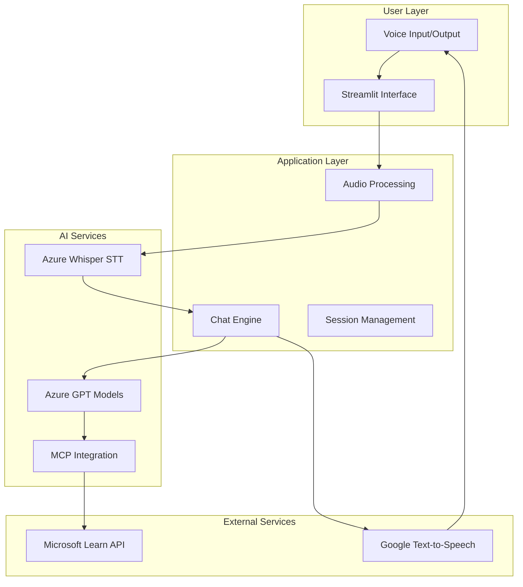
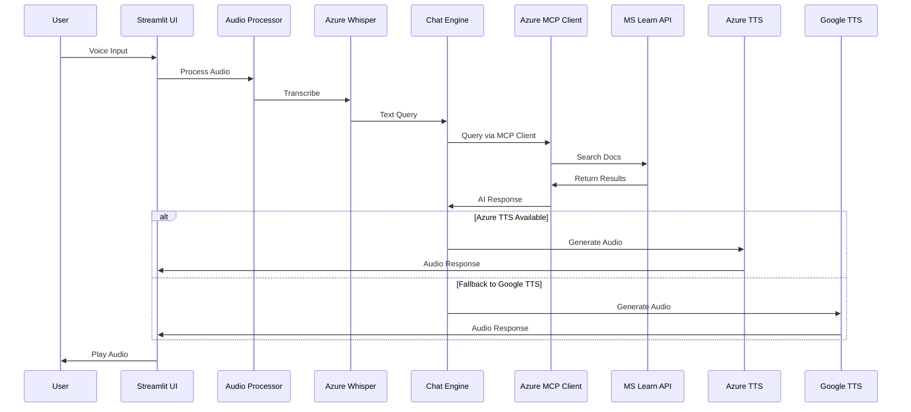

# MCPApp Documentation Index

Welcome to the comprehensive documentation for MCPApp, a voice-enabled conversational AI application powered by Azure OpenAI and Microsoft Learn documentation through the Model Context Protocol (MCP).

## 📚 Documentation Structure

### Core Documentation
- **[ARCHITECTURE.md](../ARCHITECTURE.md)** - Complete system architecture with Mermaid diagrams
- **[README.md](../README.md)** - Project overview and quick start guide

### Technical Documentation
- **[TECHNICAL_OVERVIEW.md](TECHNICAL_OVERVIEW.md)** - Detailed technical implementation guide
- **[API_REFERENCE.md](API_REFERENCE.md)** - Comprehensive API documentation with examples
- **[DEPLOYMENT_GUIDE.md](DEPLOYMENT_GUIDE.md)** - Azure App Service deployment instructions

## 🏗 Architecture Overview

MCPApp implements a sophisticated voice-to-voice AI interaction system with the following key components:



## 🚀 Quick Navigation

### For Developers
1. Start with [TECHNICAL_OVERVIEW.md](TECHNICAL_OVERVIEW.md) for implementation details
2. Review [API_REFERENCE.md](API_REFERENCE.md) for integration patterns
3. Check [ARCHITECTURE.md](../ARCHITECTURE.md) for system design

### For DevOps/Deployment
1. Follow [DEPLOYMENT_GUIDE.md](DEPLOYMENT_GUIDE.md) for Azure setup
2. Review security and monitoring sections
3. Configure auto-scaling and alerts

### For Architects
1. Study [ARCHITECTURE.md](../ARCHITECTURE.md) for complete system design
2. Review component diagrams and data flows
3. Understand MCP integration patterns

## 🔧 Technology Stack

| Component | Technology | Purpose |
|-----------|------------|---------|
| **Frontend** | Streamlit | Web UI and user interaction |
| **Audio Processing** | Azure Whisper | Speech-to-text conversion |
| **AI Engine** | Azure OpenAI MCP Client | Conversation and Microsoft Learn integration |
| **Knowledge Integration** | MCP Protocol | Direct Microsoft Learn documentation access |
| **Audio Output** | Azure OpenAI TTS + Google TTS | Dual text-to-speech conversion |
| **Deployment** | Azure App Service | Cloud hosting and scaling |

## 📊 Key Features

### Voice-First Interface
- Natural language voice input
- Real-time speech-to-text processing via Azure Whisper
- Dual audio response generation (Azure OpenAI TTS + Google TTS fallback)
- Hands-free interaction with wide layout UI

### Enhanced MCP Integration
- Direct Azure OpenAI MCP client integration
- Real-time Microsoft Learn documentation access
- Streamlined response processing
- Optimized for Microsoft Learn queries

### Scalable Architecture
- Stateless application design
- Azure App Service auto-scaling
- Efficient resource management
- High availability deployment

## 🔄 Data Flow



## 🛡 Security Features

- Environment variable-based configuration
- No hardcoded credentials
- HTTPS/TLS encryption
- Temporary file auto-cleanup
- Session isolation
- API rate limiting

## 📈 Monitoring and Analytics

- Application Insights integration
- Performance metrics collection
- Error tracking and alerting
- User interaction analytics
- Scalability monitoring

## 🔧 Development Setup

1. **Prerequisites**
   - Python 3.12+
   - Azure OpenAI service
   - Azure App Service (for deployment)

2. **Quick Start**
   ```bash
   git clone https://github.com/your-username/mcpapp
   cd mcpapp
   pip install -r requirements.txt
   cp sample.env .env
   # Configure .env with your Azure credentials
   streamlit run app.py
   ```

3. **Documentation Updates**
   - Mermaid diagrams are embedded in Markdown
   - Use GitHub's Mermaid rendering or local preview
   - Update diagrams when architecture changes

## 📝 Contributing

When contributing to MCPApp documentation:

1. **Architecture Changes**
   - Update relevant Mermaid diagrams
   - Ensure consistency across all documentation
   - Test diagram rendering

2. **API Changes**
   - Update API_REFERENCE.md
   - Include new sequence diagrams
   - Update error codes and examples

3. **Deployment Changes**
   - Update DEPLOYMENT_GUIDE.md
   - Test deployment instructions
   - Update configuration examples

## 📞 Support

For technical support or questions:
- Review the appropriate documentation section
- Check troubleshooting guides
- Submit issues with detailed information

## 📊 Documentation Metrics

| Document | Purpose | Audience | Complexity |
|----------|---------|----------|------------|
| ARCHITECTURE.md | System design overview | All stakeholders | High |
| TECHNICAL_OVERVIEW.md | Implementation details | Developers | Medium |
| API_REFERENCE.md | Integration guide | Developers | High |
| DEPLOYMENT_GUIDE.md | Deployment instructions | DevOps | Medium |

---

*This documentation is maintained alongside the codebase and updated with each release. For the latest version, always refer to the main branch documentation.*