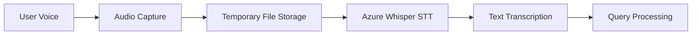
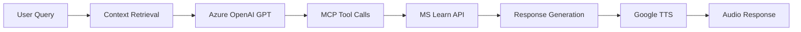

# MCPApp Technical Overview

## System Description

MCPApp is a sophisticated voice-enabled conversational AI application that bridges human users with Microsoft Learn documentation through advanced AI technologies. The application implements a complete voice-to-voice interaction pipeline, leveraging Azure OpenAI services and the Model Context Protocol (MCP) for intelligent information retrieval.

## Core Architecture Principles

### 1. Voice-First Design
The application prioritizes voice interaction as the primary user interface, creating a natural and accessible experience for users who prefer spoken communication over traditional text-based interfaces.

### 2. Real-Time Documentation Access
Through MCP integration, the system provides instant access to Microsoft Learn's comprehensive documentation, ensuring users receive current and accurate technical information.

### 3. Stateless Scalability
The application design supports horizontal scaling on Azure App Service through stateless component architecture and efficient session management.

## Technical Implementation Details

### Audio Processing Pipeline



### Response Generation Pipeline



## MCP Integration Specification

### Protocol Implementation
The application implements MCP (Model Context Protocol) to enable seamless integration between the GPT model and external knowledge sources. This protocol allows for:

- Real-time documentation queries
- Contextual information retrieval
- Dynamic content filtering
- Multi-source knowledge aggregation

### Tool Definition
```json
{
  "type": "function",
  "function": {
    "name": "mcp_tool",
    "description": "Queries the Microsoft Cloud Documentation information.",
    "parameters": {
      "type": "object",
      "properties": {
        "query": {
          "type": "string",
          "description": "The query to send to the MCP API."
        }
      },
      "required": ["query"]
    }
  }
}
```

## Performance Characteristics

### Latency Optimization
- Direct Azure OpenAI API integration minimizes network hops
- Temporary file management reduces I/O overhead
- Session state optimization prevents memory bloat

### Scalability Features
- Stateless application design
- Horizontal scaling support on Azure App Service
- Efficient resource cleanup and management

### Error Handling
- Graceful degradation for API failures
- Automatic retry mechanisms for transient errors
- User-friendly error messaging

## Security Implementation

### Credential Management
- Environment variable-based configuration
- No hardcoded secrets in source code
- Azure Key Vault integration ready

### Data Protection
- Temporary file automatic cleanup
- Session isolation between users
- No persistent storage of user conversations

### Network Security
- HTTPS/TLS encryption for all communications
- Azure managed identity support
- API key rotation capabilities

## Deployment Architecture

### Azure App Service Configuration
```yaml
runtime: python:3.12
startup_command: bash streamlit.sh
environment_variables:
  - AZURE_OPENAI_ENDPOINT
  - AZURE_OPENAI_KEY
  - AZURE_OPENAI_DEPLOYMENT
scaling:
  auto_scale: enabled
  min_instances: 1
  max_instances: 10
```

### Resource Requirements
- **CPU**: 1 vCPU minimum, 2 vCPU recommended
- **Memory**: 1GB minimum, 2GB recommended
- **Storage**: Minimal (temporary files only)
- **Network**: Outbound HTTPS access required

## Monitoring and Observability

### Key Metrics
- API response times (Azure OpenAI, MCP, TTS)
- Audio processing duration
- Session management overhead
- Error rates and types

### Logging Strategy
- Structured logging with correlation IDs
- Performance metrics collection
- Error tracking and alerting
- User interaction analytics

## Development Guidelines

### Code Organization
```
mcpapp/
├── app.py              # Main application entry point
├── requirements.txt    # Python dependencies
├── streamlit.sh       # Deployment script
├── sample.env         # Environment template
├── ARCHITECTURE.md    # System architecture
├── README.md          # Project overview
└── docs/              # Technical documentation
```

### Testing Strategy
- Unit tests for core functions
- Integration tests for API interactions
- End-to-end user journey testing
- Performance benchmarking

### Quality Assurance
- Code linting with pylint/flake8
- Type checking with mypy
- Security scanning with bandit
- Dependency vulnerability scanning

## Future Roadmap

### Short-term Enhancements
1. **Enhanced Error Handling**: Improved user feedback for failures
2. **Performance Monitoring**: Real-time metrics dashboard
3. **Multi-language Support**: Extend to additional languages

### Medium-term Features
1. **User Authentication**: Personalized experiences
2. **Conversation Persistence**: Optional chat history storage
3. **Advanced RAG**: Vector embeddings integration

### Long-term Vision
1. **Mobile Applications**: Native iOS/Android apps
2. **Offline Capabilities**: Local model deployment
3. **Enterprise Features**: SSO, audit logging, compliance

## Contributing Guidelines

### Development Setup
1. Clone the repository
2. Create virtual environment: `python -m venv venv`
3. Install dependencies: `pip install -r requirements.txt`
4. Configure environment variables from `sample.env`
5. Run locally: `streamlit run app.py`

### Pull Request Process
1. Fork the repository
2. Create feature branch
3. Implement changes with tests
4. Update documentation
5. Submit pull request with detailed description

## Support and Maintenance

### Documentation Updates
- Architecture diagrams updated with system changes
- API documentation maintained with code changes
- Deployment guides verified with each release

### Version Management
- Semantic versioning for releases
- Change log maintenance
- Migration guides for breaking changes